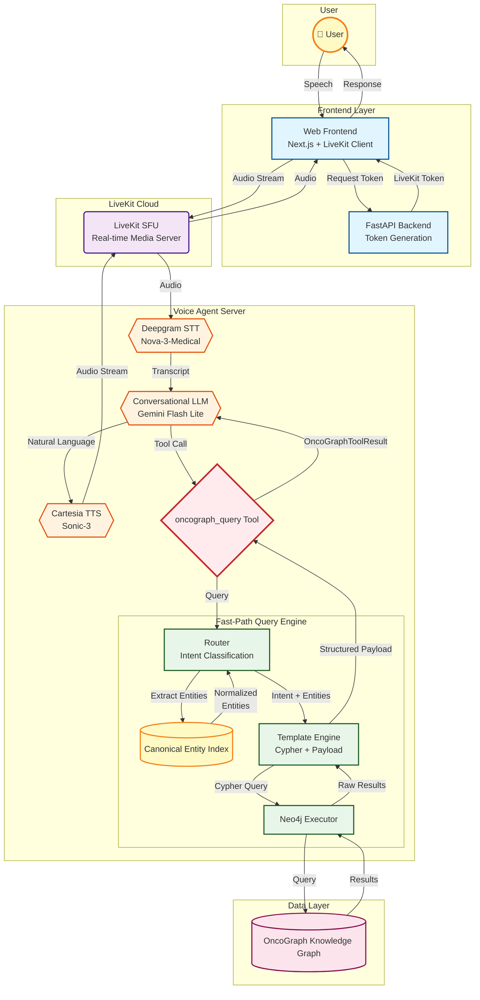

# OncoGraph Voice Agent Architecture

High-level system architecture diagram. For detailed component descriptions, performance targets, and query types, see [README.md](README.md).

## System Architecture

The voice agent uses a two-tier architecture: a **Fast-Path Query Engine** for sub-2-second graph queries, and a **Conversational Agent** that handles voice I/O and natural language generation.

## Key Flow

1. **User speech** → Frontend → LiveKit Cloud → STT
2. **STT transcript** → Conversational LLM
3. **If graph query** → `oncograph_query` tool → Fast-Path Engine
4. **Fast-Path**: Router → Entity Index (normalize) → Template → Neo4j → Structured payload
5. **Tool result** → Conversational LLM → Natural language response
6. **Response** → TTS → LiveKit → Frontend → User

For implementation details, see [README.md](README.md).

